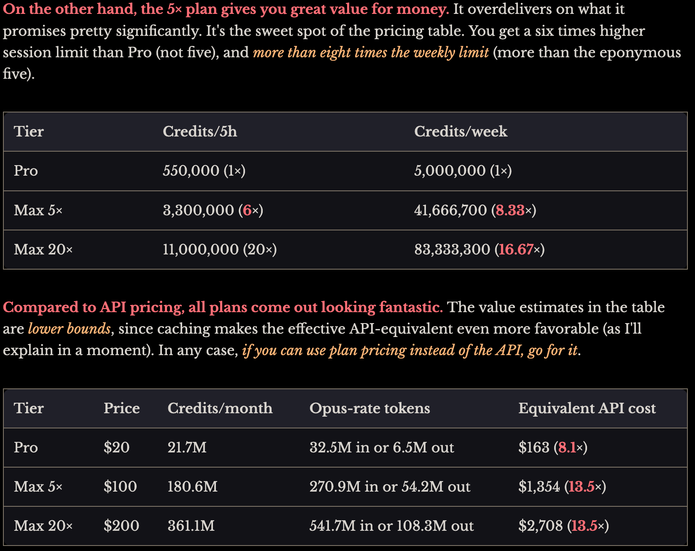

How someone used an unrounded float in the Anthropic API to extract the exact token usage limits with the Stern-Brocot tree search method. TL;DR: In terms of weekly credits, Max5 is actually Max8.33, and Max20 is 2 times Max5 (not 4 times, that applies only to the 5h limit).

