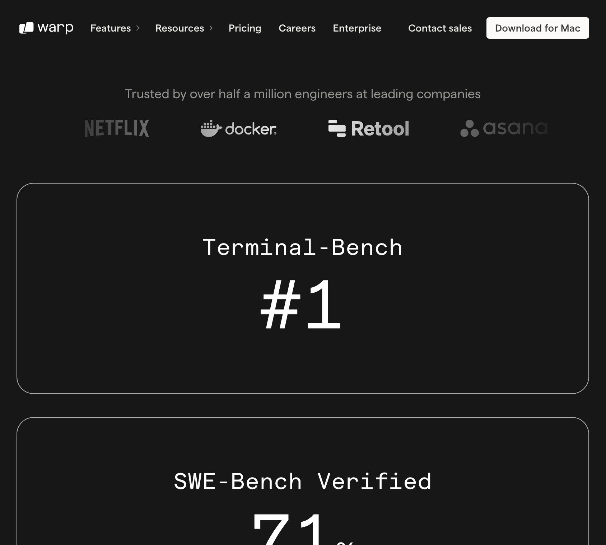

There are three things from how they build Claude Code that make it really good in my opinion:

1. Dogfooding: I find the term gross, but intensively using your own products is a great way to stay in touch with what works and what's missing!
2. Build what you want: If you use your own product a lot (see 1) and you are confident that you overlap with your target audience, you are in a great position: Just build whatever *you* would like most in your product!
3. Prototype and test internally: Instead of long studies, new features are prototyped quickly and deployed internally to ants (how Anthropic employees call themselves). Ants use it a lot? Polish it, and off it goes into prod.

It's incredible how quickly they pick up on these various usage patterns, as [the product owner Catherine Wu explains in an interview](https://www.youtube.com/watch?v=DAQJvGjlgVM). They know precisely how people use it, from multiple claude instances in parallel to engineers at smaller companies letting Claude work more autonomously.

Btw: Using Claude Code intensively to work on improving Claude Code ... is that the AI self-acceleration singularity twitter folk have been talking about? Just with some SWEs in the loop..? Anyways...

And obviously they have a larger vision of letting other companies build on their core agentic loop and tools. I am curious to see how this evolves. As much as Claude Code comes with all the rails you need (tools, permission system, a sort of UI), building on it would limit you to Anthropic's models [[1]](#fn1) (which are far from the worst, quite the opposite, but a lock-in nonetheless).

---

1. See the last section for alternative models in Claude Code! [↩︎](#fnref1)

## Benchmarks

Anthropic [doesn't care too much about benchmarks](https://www.anthropic.com/research/evaluating-ai-systems). At least it's how I interpret their behavior. The fact that they don't offer some crazy expensive test-time scaling method to run on the benchmarks to claim a slightly higher spot is maybe a decent argument for this. If you look at the benchmarks, their 'extended thinking' doesn't even use half the reasoning tokens that GPT-5 (high) (which OpenAI's benchmark claims are based on) uses. Their frontier model uses just over half of GPT-5 (medium).

Number of tokens used to solve the Artificial Analysis benchmark for various models. Claude Opus thinking uses 26M tokens in total, far less than GPT-5 medium (43M), GPT-5 high (82M) or Grok 4 (110M)

If you check out the [TerminalBench](https://www.tbench.ai/leaderboard) leaderboard, an agentic benchmark on Terminal tasks, you will see that there are SWE agents outperforming Claude Code *using the same models*. Claude Code with Sonnet has 35.5%, with Opus 43.2%. Engine Labs beats that at 44.8% *using Sonnet*. So their agentic framework beats Claude Code, *despite* Claude Code using the much stronger Opus model! So maybe Claude Code is not the absolute most effective agent, but something makes it really nice to use. And perhaps that makes the human-AI combination of me and claude code more effective overall.

tbench leaderboard as of 2nd September 2025

I wouldn't put *too much faith* in these numbers. The terminal bench evaluation set is [publicly available](https://github.com/laude-institute/terminal-bench) and still under active development (paper and curated 'final' v1 benchmark out soon!). But that doesn't prevent warp.dev from advertising with their number one spot using GPT-5, though. Also, companies have every incentive to maximize their numbers. I'm not saying they are cheating or anything, but maybe they are using (for everyday use) unreasonably high reasoning settings or other test-time scaling methods.

warp.dev prominently advertising their Terminal-Bench spot number one on their website

## What else..

For now, [you can use Claude Code with other models](https://github.com/1rgs/claude-code-proxy) btw. I tried the shortly hyped Kimi-K2, but the small context window just doesn't work for it. Z.ai is actually selling a [plan 'exclusive to Claude Code'](https://z.ai/subscribe) and has an [integration guide](https://docs.z.ai/scenario-example/develop-tools/claude) on how to use it instead of the Anthropic models. Will Anthropic embrace this? Right now the documentation about how to change the endpoint seems geared towards [enterprise use](https://docs.anthropic.com/en/docs/claude-code/third-party-integrations), and they don't support any APIs except their own. They could either accept that this happens and promotes Claude Code further, or they could try to lock Claude Code down and prevent it from being used with other providers, since they lose out on revenue. Let's see!

Also: Agents as a pipeline step are crazy effective. Just look at how Anthropic is cleaning up their Github repo using [claude github actions](https://github.com/anthropics/claude-code/blob/main/.github/workflows/claude-issue-triage.yml). Locally, you can also pipe into claude with `echo 'do something' | claude -p`. This sends claude off an a whole agentic loop until it decides to print some output, which you can of course pipe into the next thing.
