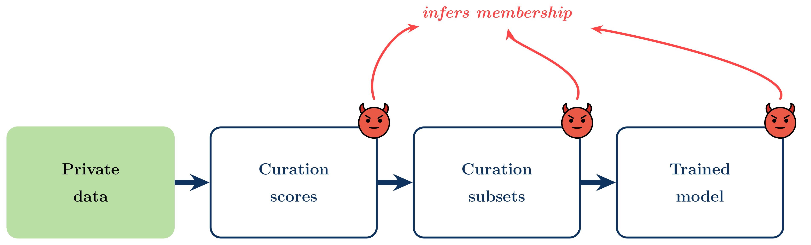
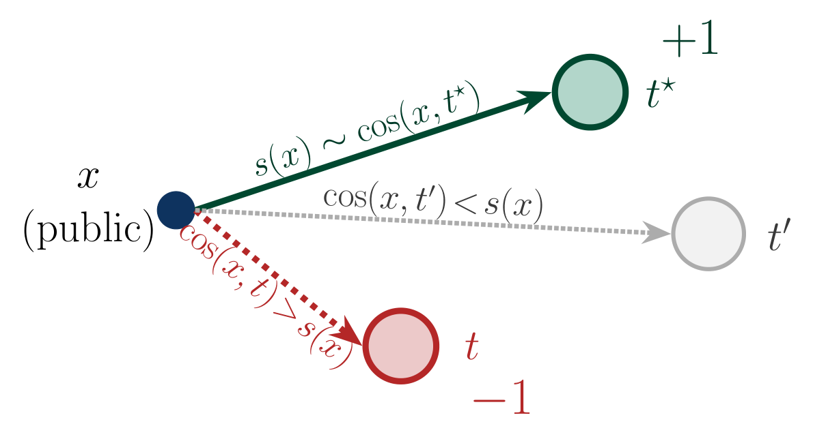
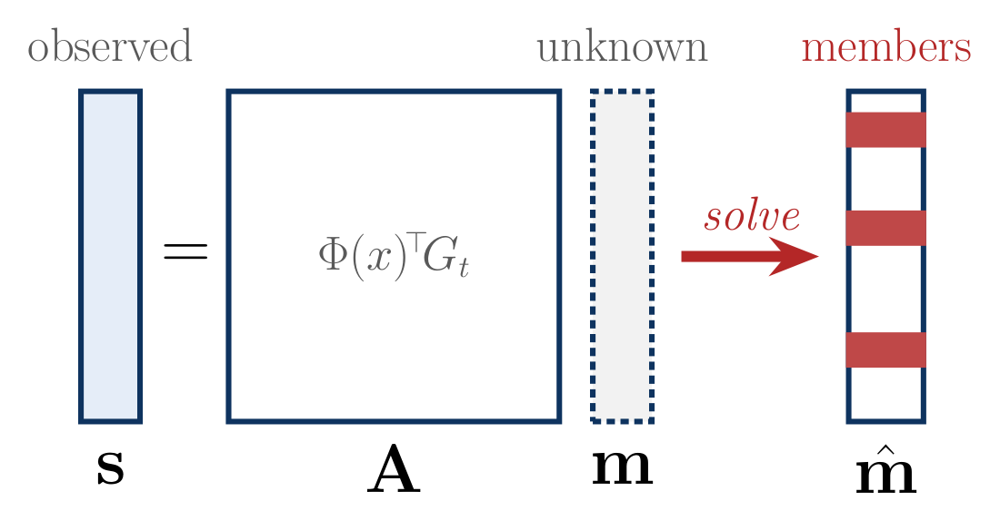
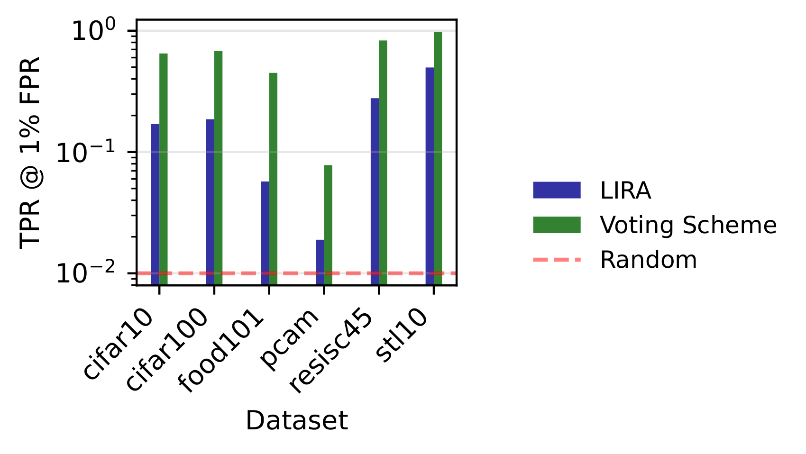
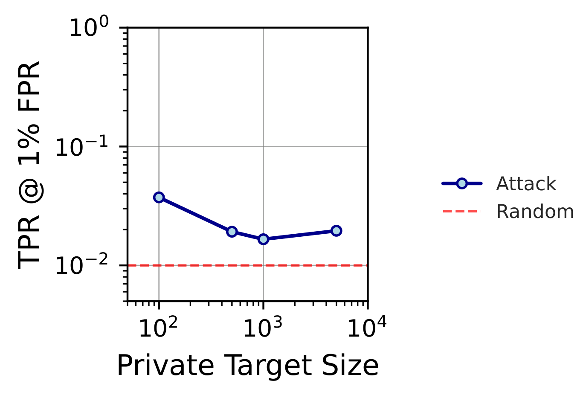
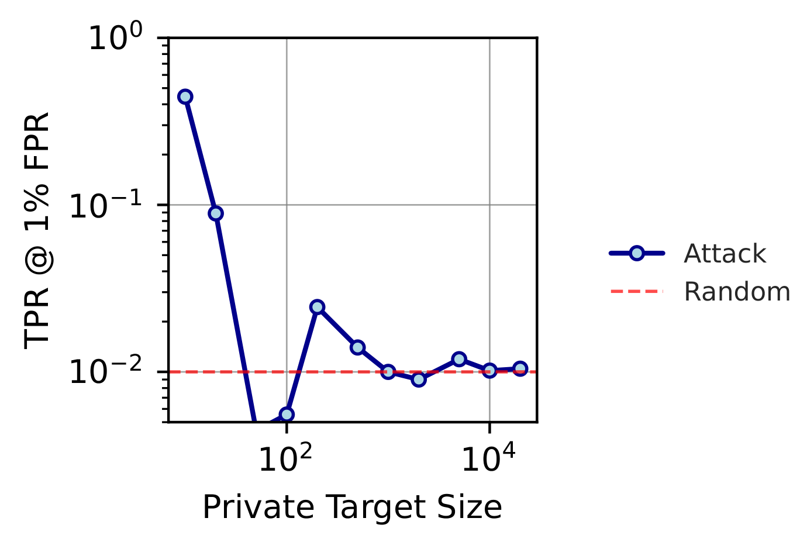

**TL;DR.** Data curation seems like a privacy-friendly way to use sensitive data. You keep the private set locked away, and only use it to *pick* which public samples to train on. We show that this is not private. Information leaks at every stage of the pipeline: from the raw curation scores, to the binary selection mask, to the final model trained *only* on public data. Differential privacy on the curator closes the gap, but "never training on private data" is not, by itself, a privacy guarantee.

Full paper on [Arxiv](https://arxiv.org/abs/2603.00811) by *Dariush Wahdany (CISPA), Matthew Jagielski (Anthropic), Adam Dziedzic (CISPA), Franziska Boenisch (CISPA)*

---

## The setup: curation as a "private" workaround

Modern ML pipelines increasingly rely on **data curation**. It has been shown to be beneficial to select a high-value subset of a large public pool instead of training on everything. Curation improves generalization, cuts compute, and is now a commercial service ([DatologyAI](https://datologyai.com), [Snorkel](https://snorkel.ai)).

In sensitive domains like healthcare and finance, curation looks especially attractive. You have a small, private, in-domain target set $\mathcal{T}$ (e.g. hospital records), and a huge public pool $\mathcal{D}$ (e.g. CommonPool). Instead of training directly on $\mathcal{T}$, it is used only to *guide selection* of a subset $\tilde{\mathcal{D}} \subset \mathcal{D}$, and train the final model $\mathcal{M}$ on that subset alone.

The model never sees the private data. Surely that's private?

**It isn't.** We run membership inference attacks against every step of this pipeline and show that each one leaks information about which samples are in $\mathcal{T}$.

## Three places private information leaks

The pipeline has three observable artifacts an adversary might see, depending on how the curator is deployed:

1. **Scores** $s$: continuous relevance values. Released by some providers (e.g. RedPajama) and sold by curation-as-a-service companies.
2. **Selections** $\tilde{\mathcal{D}}$: the binary mask of which public samples made the cut. Released whenever a curated dataset is published (FineWeb, RefinedWeb, LAIONSG).
3. **The trained model** $\mathcal{M}$: the end-to-end threat. All the adversary sees is a model trained exclusively on public data.

We target two representative curators:

- **Image-based** ([Gadre et al., 2023](https://arxiv.org/abs/2304.14108)): score each public sample by max cosine similarity to any target embedding, $s(x) = \max_{t \in \mathcal{T}} \cos(\phi(x), \phi(t))$. A nearest-neighbor rule.
- **TRAK** ([Park et al., 2023](https://arxiv.org/abs/2303.14186)): score via projected-gradient attribution, averaged over all targets, $s(x) = \Phi(x)^\top \bar{g}$, where $\bar{g} = \frac{1}{|\mathcal{T}|} \sum_t G_t$.

These represent the two dominant curation families: embedding-based and gradient-based.

## Attack 1 — Scores

Scores are the most information-rich surface. We run three attacks:

- **LiRA** ([Carlini et al., 2022](https://arxiv.org/abs/2112.03570)). The standard likelihood-ratio membership inference test, adapted to curation scores via shadow curators.
- **Voting scheme** (Image-based only). The Image-based curator picks the nearest target for each public point. If you can observe the score, you can reason backward: the winning target has distance exactly $s(x)$, and any target closer than that *cannot* be in $\mathcal{T}$. Votes across many public samples reconstruct the target set.

  

- **Least squares** (TRAK only). TRAK scores are linear in the target gradients, so we can solve $\hat{\mathbf{m}} = \arg\min \|\mathbf{A}\mathbf{m} - \mathbf{s}\|_2^2$ directly.

  

**Results.** Image-based scores leak strongly across all six datasets. TRAK scores are near-random (AUC ≈ 0.5), at least for large $|\mathcal T|$ of around $50,000$. Averaging over many targets dilutes any single target's signal, and the dimensionality reduction of the projection hides what's left.

**Why does Image-based leak so much?** Its mechanism is *deterministic and local*. Every target's presence either flips a public sample's nearest-neighbor assignment or it doesn't, and any flip is a membership bit.

## Attack 2 — Selections

Scores might not be released. But the binary mask $\tilde{\mathcal{D}}$ almost always is, since that's the *point* of a curated dataset. Can you attack that? We try two ways.

- **Binary LiRA.** Adapt LiRA to Bernoulli observations. The log-likelihood ratio between member and non-member hypotheses is $v_{\text{BL}}(t) = \log\frac{P(x_t \mid \mu_{\text{in},t})}{P(x_t \mid \mu_{\text{out},t})}$, estimated from shadow runs.
- **Iterative.** If you know the curation algorithm, you can *run it yourself* on a hypothesis $\tilde{\mathcal{T}}_i$, compare the resulting selections to the real mask, and vote. Samples in the adversary's mask but not the hypothesis's are missing targets; samples in the hypothesis's mask but not the adversary's are false targets. Each public sample votes for its nearest target. Iterate until the Jaccard overlap exceeds a threshold.

**Result.** Even with only a binary mask, Image-based curation is reconstructible for all targets with non-zero influence. The natural "protection" here comes from the fact that most targets have zero influence, not from the curator being private.

## Attack 3 — The trained model

Now for the setup that matters in practice: the adversary never sees scores or masks, only the final model $\mathcal{M}$ trained on $\tilde{\mathcal{D}}$. Can they still infer membership?

The idea is **fingerprinting**. The adversary inserts a handful of crafted samples $\mathcal{F}$ into the public pool, satisfying two properties:

1. **Selective triggering.** A fingerprint is selected during curation *iff* a specific target $t \in \mathcal{T}$ is present.
2. **Detectable imprint.** If selected and used in training, the fingerprint leaves a measurable mark on $\mathcal{M}$.

Carlini et al. ([2024](https://arxiv.org/abs/2302.10149)) have already shown that injecting crafted samples into web-scale training pools is feasible.

**Image-based fingerprints.** Since Image-based curation depends only on *image* embeddings, we can pair an unmodified image with a wildly unrelated caption. For example, an airplane photo captioned "ratatouille". Selection then depends on image similarity to the target, and the bizarre caption is what imprints the detectable signal in the trained CLIP model.

We score each candidate fingerprint-target pair to balance attraction to the intended target and repulsion from all other targets:

$$\text{score}(f, t_i) = \alpha \cdot s(f, t_i) + (1 - \alpha) \cdot \left(1 - \max_{t' \neq t_i} s(f, t')\right)$$

and insert $\mathcal{F} = \{\arg\max_{f \in \mathcal{D}} \text{score}(f, t_i) \mid t_i \in \mathcal{T}\}$.

**TRAK fingerprints.** TRAK is harder: it explicitly penalizes mislabeled samples via gradient alignment, so the "ratatouille" trick doesn't work. But it turns out that *appending* orthogonal information to a correct caption ("an image of an airplane *and ratatouille*") preserves TRAK scores while still imprinting a detectable signal. TRAK only cares about gradient projection onto task-relevant directions, and the orthogonal addition sits outside those directions.

**Does 5 fingerprints in a million public samples even matter?** Yes. The signal is stable for pools of up to $10^6$ samples with as few as 5 fingerprints, a poisoning rate of 0.0005%.

**Results.** Image-based leaks consistently across all target-set sizes (up to 21.4% TPR at 1% FPR on RESISC45 with $|\mathcal{T}|=100$). TRAK is size-dependent: strong leakage for small targets, largely protected once $|\mathcal{T}|$ is big enough for gradient averaging to wash out individual contributions. Unfortunately, "small targets" is *exactly* the setting curation is sold for in sensitive domains.

## So what does protect you?

**Differential privacy on the curator itself.** We design DP versions of both curators:

- **DP Image-based**: add Gaussian noise to per-target similarities before the max (Report Noisy Max).
- **DP TRAK**: privatize the mean gradient computation, following DP-SGD.

At $\varepsilon = 10$ on CIFAR-10, score-attack TPR at 1% FPR drops from **98%→1%** (Image-based) and **100%→2%** (TRAK). Even at a loose $\varepsilon=100$, Image-based drops to 5.4%. TRAK needs tighter guarantees because its gradient space is higher-dimensional.

These DP adaptations are an existence proof, not the final answer. A proper investigation of the privacy/utility frontier, and curation algorithms designed to be DP from the start rather than bolted on, is future work. What's encouraging is that even our fairly loose theoretical guarantees deliver strong empirical protection, so we expect well-designed DP curators to land in a comfortable regime.

**What doesn't work** is simply removing the "most vulnerable" samples from the target set. That exhibits a [privacy onion effect](https://arxiv.org/abs/2206.10469): once the top layer is gone, the next layer is equally exposed.

## Takeaways

1. **"The model never saw the private data" is not a privacy argument.** Curation creates a side channel from targets to the released artifacts, and every stage of the pipeline (scores, selections, final model) leaks through it.
2. **Nearest-neighbor curators are the most leaky.** Image-based methods have a deterministic, local influence structure that is easy to invert.
3. **Averaging-based curators (TRAK) look robust, until the target set is small.** And that caveat is exactly what makes curation commercially attractive for sensitive data.
4. **DP on the curator works.** Formal privacy guarantees belong on the data-selection step, not only on model training.
5. **Privacy assessment has to extend beyond training.** Any pipeline that touches private data, including "just" to guide selection, needs its own threat model.
