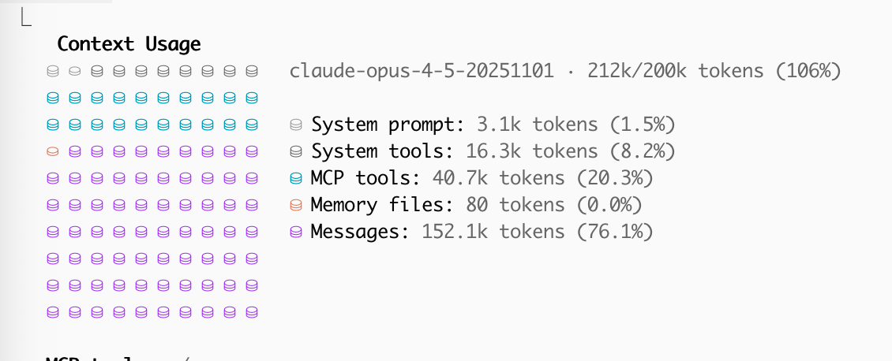

Claude Code has an auto-compact feature. If you run into the last 20% or so of the context window limit, upon finishing the generation it will automatically compact all previous messages. This is mostly fine, but it can happen at very awkward spots and then degrates performance, which is why I turned it off. You can instead/additionally manually compact with optional instructions, like `/compact keep parts relevant to the DB migration`. 

I don't know if this is intended or not, but disabling auto-compacting also seems to let you go over the context limit? As you can see I got up to 106%. It's possible that it's just cutting off the earliest context then, but at least it's good to know that you can keep going without compacting.

