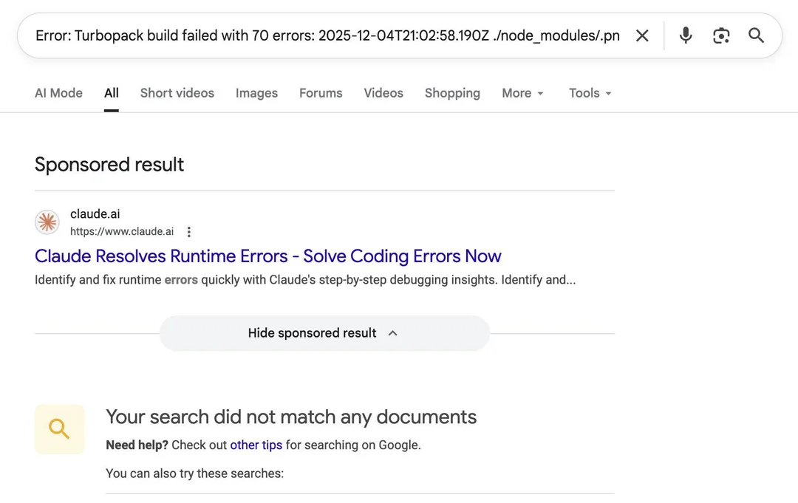

Intent-based advertising means capturing and converting a user based on something they intend to do or to acquire. It doesn't work for every product, because often potential users are not aware of the problem and don't go out looking and intending to do something about it. Anthropic uses an interesting intent to advertise Claude ([per twitter](https://x.com/0xMasonH/status/1996687988089049165?s=20)), namely that they bid on searches for stack traces.

So if someone searches for a stack trace with no results, they are served a Claude ad (which is, admittedly, very good at solving those!). It's a genius way of indirect intent-based ads. Those ads are probably very cheap as well (for now), because the price is determined by your competition on those keywords (it's a bidding process, albeit with one entity simulatenously owning the marketplace and supply).

