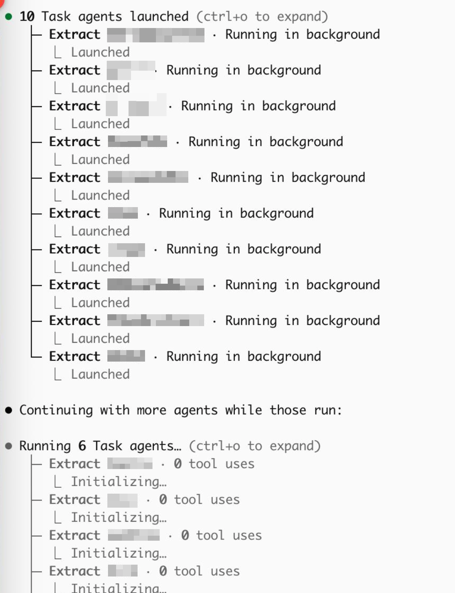

Claude Code now has asynchronous subagents, meaning the main agent can spawn subagents (this is not new) that keep running in the background (this is new). I don't know if Anthropic as imposed a limited on this feature, but for me it definitely has replaced some API use cases, since I managed to have it spawn over 100 subagents to process a bunch of documents. Not sure if that is what they intended it for, but it's nice!

