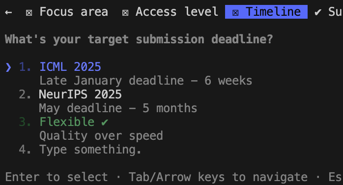

LLMs are not human. But they imitate human behaviour in many ways. You can threaten an LLM, you can argue with them, and you can offer a tip for a great answer, all of which will impact what sort of result you get. Recently my Claude Code has been obsessed with timelines. I don't know why, because all those three-phase, eight-week time schedules are implemented in 15 minutes anyway, but it keeps coming up with them. 

Today Claude asked me when I want to submit my work (because I said I want paper-ready figures). Naturally I would never admit to being short on time to an LLM. Just say it has all the time in the world to make them look perfect. This whole dance is becoming a bit bizarre, but keep in mind that an LLM will imitate human patterns, so don't make your LLM produce sloppy and rushed-looking work by telling it you have little time.

It doesn't take any real time to give your LLM infinite time.

