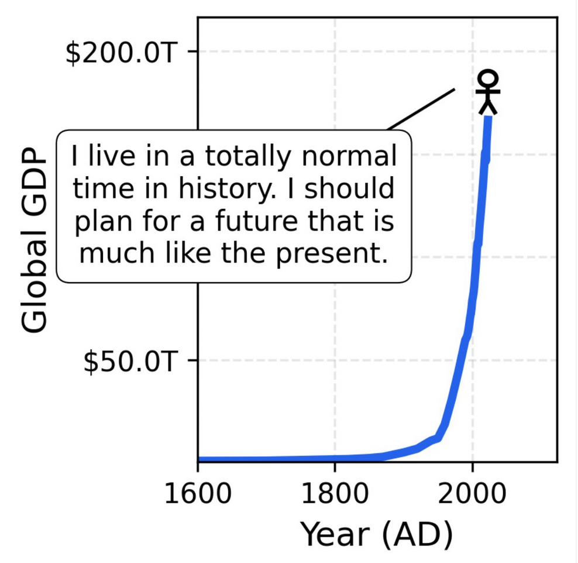

I simply can't get over this image. I saw it first in [this thread ](https://x.com/jaschasd/status/1972360405885637021/photo/1)by Jascha Sohl-Dickstein and already mentioned it in [my post about bubbles](https://blog.wahdany.eu/2025/Oct/6/bubbles/). But even months later I have to think of this: in what unprecedented times we live, and yet how we take so many things for granted. 
