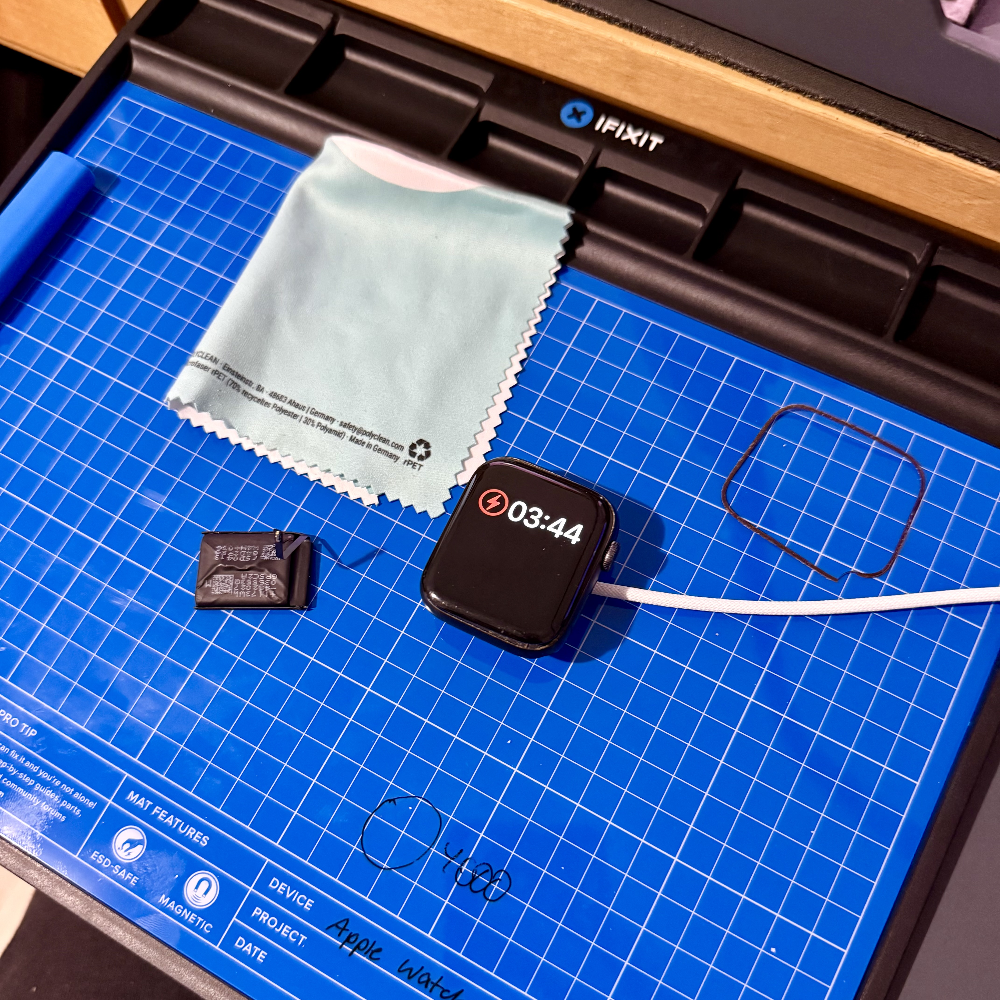

I love repairing electronics. Something about these elegant devices coming apart at the correct use of the proper tools, looking inside them, and the pride of looking at something you have assembled yourself...

To replace the battery of this Apple Watch I used an [ATTEN ST-862D ](https://www.atten.eu/product/1150852/atten-st-862d-hot-air-station)SMD reworking station (basically a very fancy hot air gun intended for (de-)soldering surface mount components), an Excel No. 10 curved blade, the [iFixit Mako Precision Bits](https://www.ifixit.com/en-eu/products/mako-driver-kit-64-precision-bits), their [magnetic project mat](https://www.ifixit.com/en-eu/products/fixmat), and their [assortment of prying and opening tools](https://www.ifixit.com/en-eu/products/prying-and-opening-tool-assortment). Putting a razor blade with force to a glass screen and prying it open is scary, and you should definitely wear eye protection in case glass shards go flying everywhere, but after turning up the heat to 150°C, it opened easily.

It's probably economically not viable to do this yourself or to replace the battery at all. This watch is like five years old, it has little value. Apple would charge 100 € to replace the battery, more than the whole watch costs. But the battery itself costs just 20 €, and with the right tools, it took me about 20 minutes. But it's fun, and it seems dumb to throw away perfectly fine electronics over a weakening battery.
