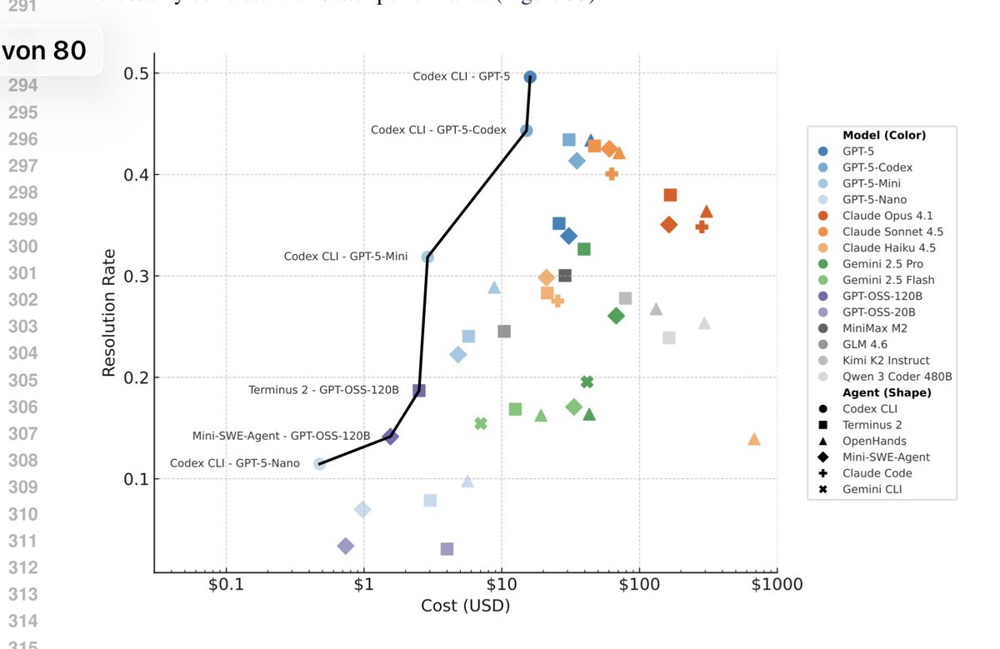
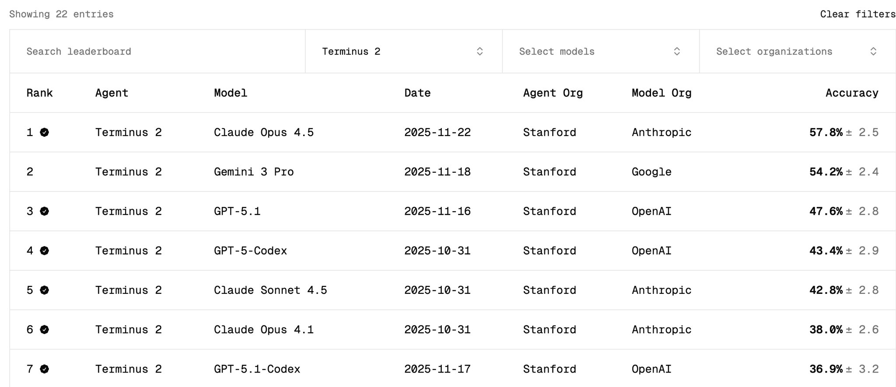
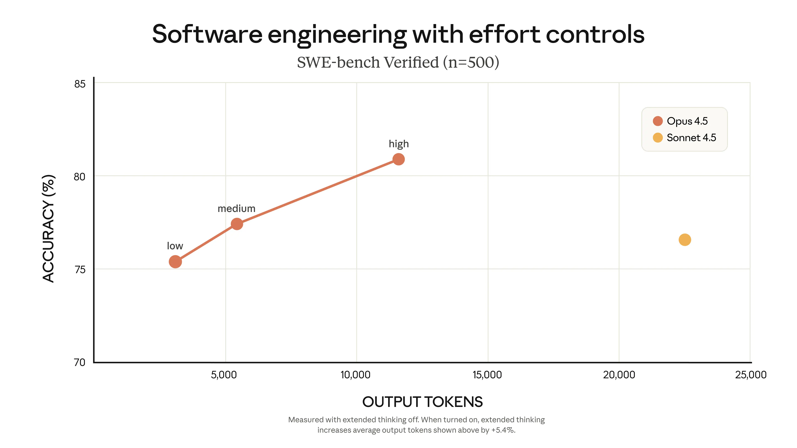

The latest version of the [terminalbench submission to ICLR](https://openreview.net/forum?id=a7Qa4CcHak) has a very GPT-pilled pareto frontier.

TerminalBench not only measures model performance, but also the agent used. If we compare everything in the Terminus-2 agent on the [tbench.ai](https://tbench.ai) homepage, wee see that Gemini 3 Pro should outperform GPT-5 in terms of raw model performance (Opus 4.5 is not part of the submission yet).

I have two thoughts on this:

1. OpenAI always seems to have some test-time scaling variant that outperforms competition. I'm a bit sceptical how good their models would be under similar "effort". Anthropic on the other hand [seems to go for token-efficiency](https://www.anthropic.com/news/claude-opus-4-5).

2. Tbench measures _autonomous _solving of the task. Claude Code performs rather poorly, despite many people liking to use it. I think it's because we rarely use Claude Code completely hands off, but rather with human feedback in the loop, for which it seems to work well.
