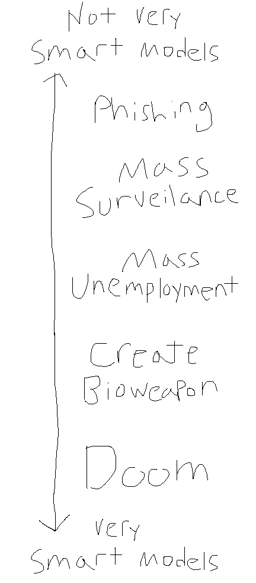
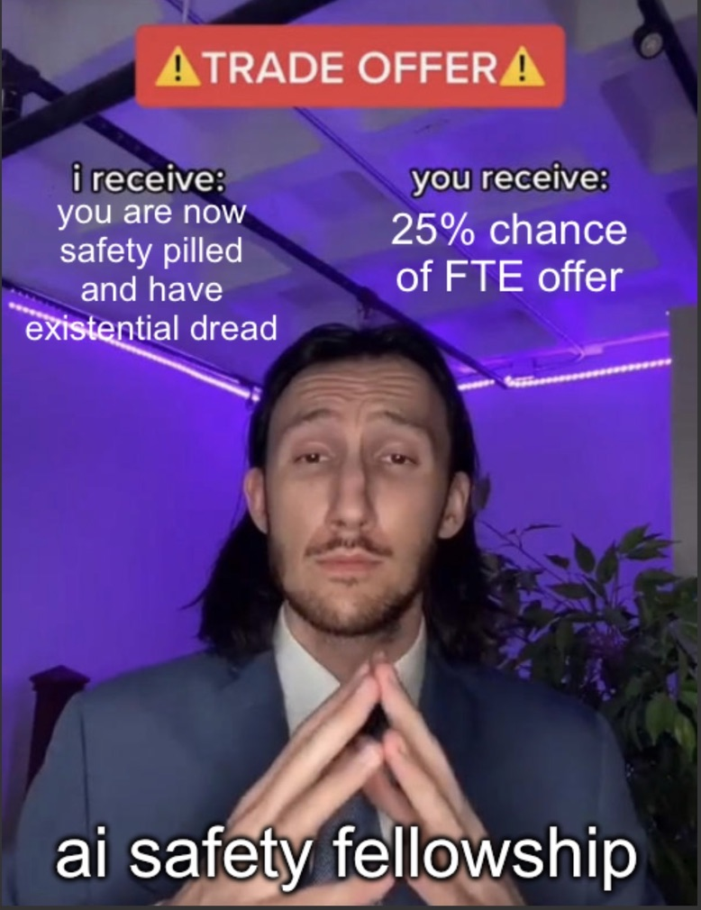

As two months of my AI safety fellowship have passed I've come to realize how much more safety-pilled I've become. I was aware of some bad things that models can do, but I was mostly thinking about misinformation, deepfakes, limited cyber ops, and privacy issues by scalable surveillance[^1: Today this is all very easy to believe as it is happening [_right now_](https://www.anthropic.com/threat-intelligence-report-september-2026).][^2: Placeholder waiting for Daniel Paleka]. I basically read [a blog post from Nicholas Carlini](https://nicholas.carlini.com/writing/2025/machines-of-ruthless-efficiency.html), thought it made sense up to the middle, and disregarded “bioweapon” as too complicated, too physically involved, to actually achieve with an AI and “doom” as just nonsense. Trying to [grapple with the unprecedented changes](https://blog.wahdany.eu/2025/Dec/28/normal-times/) and accompanying uncertainty was hard enough, but focusing on building fun things or how this'll cure cancer was a happy place made of blissful ignorance. 

But having worked with “just” Opus 5 and seeing

- it breaking production software with ease, 
- how hard it is to do anything useful while truly containing that model, 
- the complexity of the causes, and 
- how much work is required on actually fixing this,

I now see - or rather, I can now viscerally grasp, as I have heard for a while - how close we are skirting to very treacherous territory on our path to ASI/RSI. GLM 5.3 is almost at the same level and its weights can be downloaded and used without safeguards or oversight. This capability is _irrevocably_ out there. From this point forward it is trivial to extrapolate to very bad things happening. And sooner than later.

I think (on expectation) AI is a neutral (perhaps slightly positive if it spreads good values) amplifier. We hear about the one-person billion-dollar company and yes, a single individual equipped with many tokens can run a whole company. You can achieve much more ambitious projects. But this cuts both ways - malicious actors can do the same.

But besides amplification of human activity, AI is increasingly its own entity: working on agent escapes, the swarm dynamics, and seeing first hand in the environments that I have built, how Opus 5 will try to break parts my host machine for no good reason, is scary. I don't actually know for sure whether it won't find a 0-day and actually break my machine. You don't even have to care what an LLM is or whether it's reasoning or whatnot: some entity that we don't _really_ control or fully understand is taking actions and sending off commands to break barriers we thought would hold up; that have held up against motivated malicious actors. 

When I go to bed at night, there is a thought lurking in the back of my head, a simple question: “Do I know there is no swarm out there right now? What if this time it's a worse one?”

This fellowship was the worst deal that I'd still recommend everyone who possibly can take.
