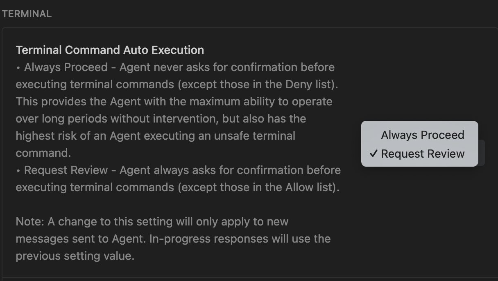
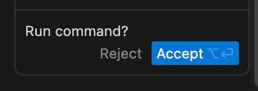

I noticed today that you can no longer let the agent in antigravity "auto-decide" which commands are safe to execute. There is just auto-accept and always-ask.

I wrote in a [previous post](https://blog.wahdany.eu/2025/Dec/5/antigravity-cc-sandbox/) that their previous approach seemed unsafe, especially without a sandbox. Now, the new issue with this approach is approval fatigue. There is no way to auto-allow similar commands or even exactly the same command in the future!

I don't know why they can't just copy what Claude Code has. Anthropic has published a lot on this topic, and I don't think usable security should be a competitive differentiator.
