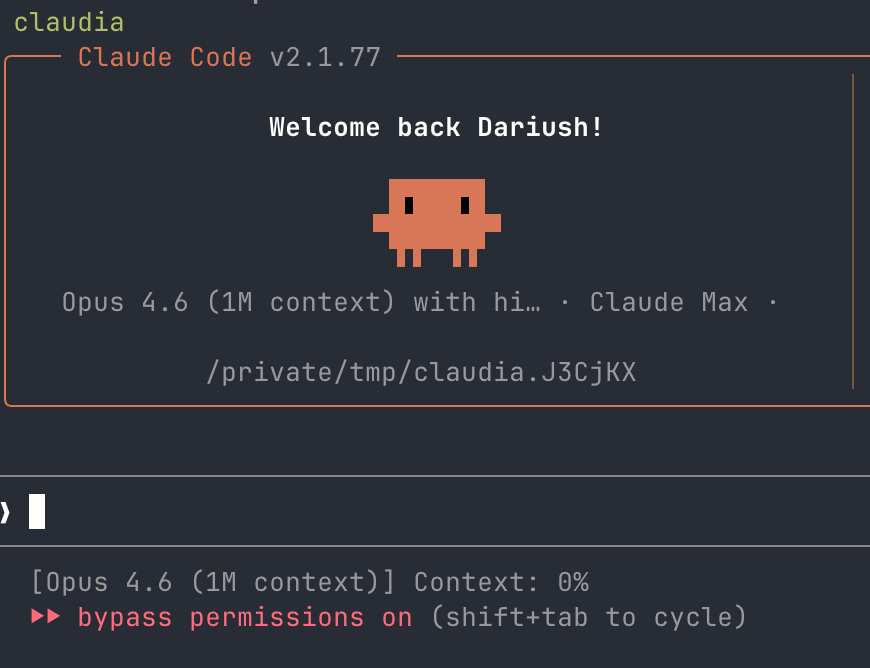

Occasionally I want Claude Code to do something that doesn't require access to any of my files or a persistent output. Think something like "open this website and summarize it for me" or "here is a link to a zip, what's in it". My goto solution was having a folder `~/empty` and starting claude in there with the built-in bubblewrap sandbox. Two issues: First, that folder is no longer empty and just fills with all the garbage I temporarily dumped there. Second, the Claude Code sandbox is not very great, both from a usability and security standpoint [^1]. And I don't want Claude to even have read access to any part of my filesystem, which is enabled by default in the sandbox.

 Now I have a new command for that, instead of claude I just call \`claudia\` (inspired by the gitworktree folder names).

```bash
claudia () {
        local dir=$(mktemp -d /tmp/claudia.XXXXXX)
        pushd "$dir" > /dev/null && safehouse --append-profile="$HOME/.config/safehouse/profiles/nix.sb" -- claude --dangerously-skip-permissions
        popd > /dev/null
        rm -rf "$dir"
}
```

It uses the [safehouse](https://agent-safehouse.dev/) sandbox-wrapper to run claude through `sandbox-exec` (mac exclusive) in a fresh temporary folder that it cleans up afterwards. In contrast to the default sandbox this also works with uv and nix-shell, using this profile. It also gives write-access to the nix-cache so the agent can run `nix-shell` and get new dependencies. This is somewhat of a security risk, but very convenient :)

<details><summary>Sandbox Profile</summary>

```plain
cat $HOME/.config/safehouse/profiles/nix.sb
;; Toolchain: Nix
;; Nix store, nix-darwin system profile, home-manager, and user profile paths.

;; Read-only access to the Nix store and daemon infrastructure.
(allow file-read*
    (subpath "/nix")
)

;; nix-darwin system profile.
(allow file-read*
    (literal "/run")
    (literal "/run/current-system")
    (subpath "/run/current-system/sw")
)

;; Per-user Nix profiles managed by nix-darwin and home-manager.
(allow file-read*
    (literal "/etc/profiles")
    (literal "/private/etc/profiles")
    (subpath "/private/etc/profiles/per-user")
    (subpath "/etc/profiles/per-user")
)

;; User-level Nix profile and caches.
(allow file-read*
    (home-literal "/.nix-profile")
    (home-subpath "/.nix-profile")
    (home-subpath "/.config/nix")
    (home-subpath "/.nix-defexpr")
    (home-literal "/.nix-channels")
)

(allow file-read* file-write*
    (home-subpath "/.cache/nix")
    (home-subpath "/.local/state/nix")
)

;; nix-darwin manages /etc/zshenv and other shell startup files.
(allow file-read*
    (literal "/private/etc/zshenv")
    (literal "/private/etc/zshrc")
    (literal "/private/etc/zprofile")
    (literal "/private/etc/profile")
    (subpath "/private/etc/paths.d")
    (literal "/private/etc/paths")
)
```

</details>



[^1]: I will link here why once responsible disclosure allows.
