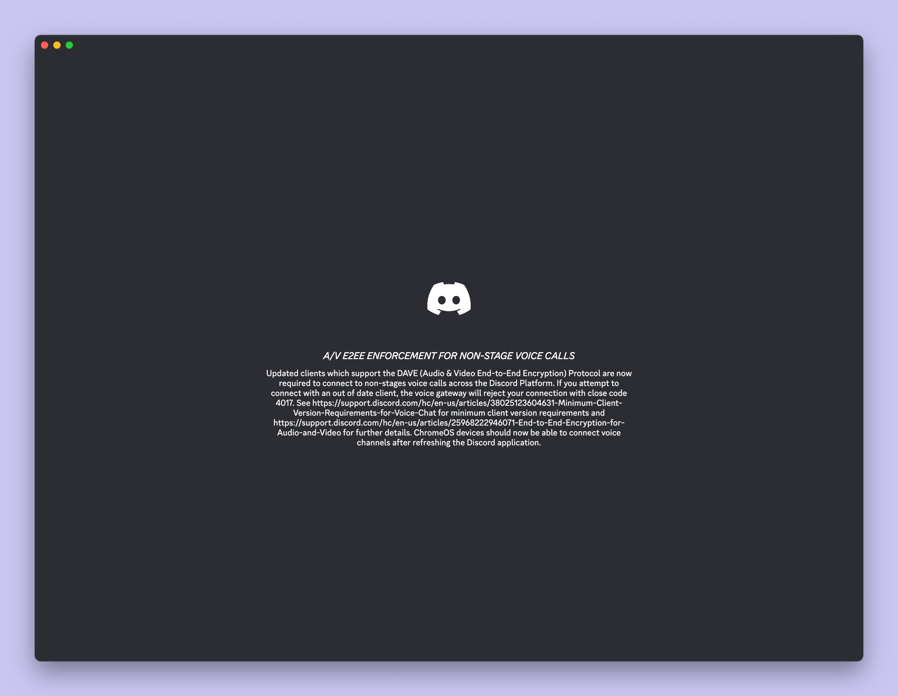

Apparently [discord is now end-to-end encrypting all calls](https://piunikaweb.com/2026/03/03/discord-enforcing-end-to-end-encryption-voice-video-calls/)? Anyways, the reason I looked into it a bizarre loading screen tip I've been getting recently. You know these loading screen tips that tell you something supposedly useful for the 1 second the app starts up?

They dropped a new loading screen tip, and I had to screenshot it to even make sense of what it was trying to say, but it says

> A/V E2EE ENFORCEMENT FOR NON-STAGE VOICE CALLS
> Updated clients which support the DAVE (Audio & Video End-to-End Encryption) Protocol are now required to connect to non-stages voice calls across the Discord Platform. If you attempt to connect with an out of date client, the voice gateway will reject your connection with close code 4017. See https://support.discord.com/hc/en-us/articles/38025123604631-Minimum-Client-Version-Requirements-for-Voice-Chat for minimum client version requirements and https://support.discord.com/hc/en-us/articles/25968222946071-End-to-End-Encryption-for-Audio-and-Video for further details. ChromeOS devices should now be able to connect voice channels after refreshing the Discord application.

Uh so yeah, I don't think this was supposed to end up as a loading screen tip. Couple of hints, like how could you read and process this in one second? Clickable links in a loading tip? And it doesn't have the "DID YOU KNOW" header like all other loading tips.

Looks a bit weird, but thanks, Discord!
