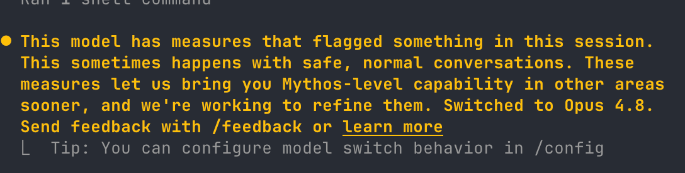

I have not been able to use Claude Fable for anything related to my work. Literally every time I tried using Fable I got this yellow box. Maybe the real Fable are the reroutes along the way ... 

The safety classifiers are super broad; anything touching on bio or cyber is immediately blocked. Since Anthropic reserves a 30d retention specifically for safety, I suspect the subscriber trial until June 22nd (which has been [cut short by US export control measures](https://www.anthropic.com/news/fable-mythos-access)) is a welcome opportunity to fine-tune those classifiers before widespread enterprise deployment.
