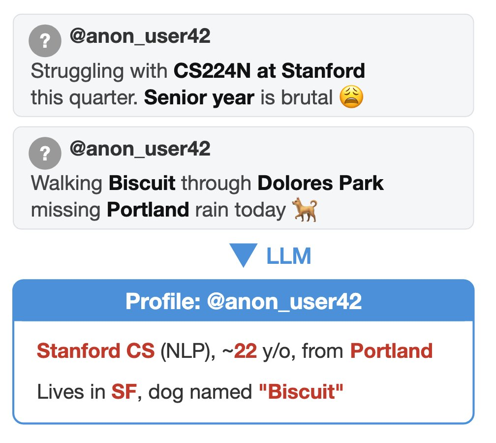

Finally someone went out to show it: every trace of information you leave in public can be scalably aggregated with LLMs to de-anonymize you. Every instance of "i work in field X" or "i'm too young for Y" can be combined to form a profile of you, and later linked to your name.

Every tweet, every comment on hackers news, it adds up and will eventually enable a linkage attack, where they have sufficient information to find a profile of yours with a name, e.g., on LinkedIn, or the specific project that you didn't mention by name.

This is from [a paper that dropped today on arxiv](https://arxiv.org/abs/2602.16800) by [Simon Lermen](https://x.com/SimonLermenAI), [Daniel Paleka](https://x.com/dpaleka) et al. under supervision from [Florian Tramèr](https://x.com/florian_tramer)
