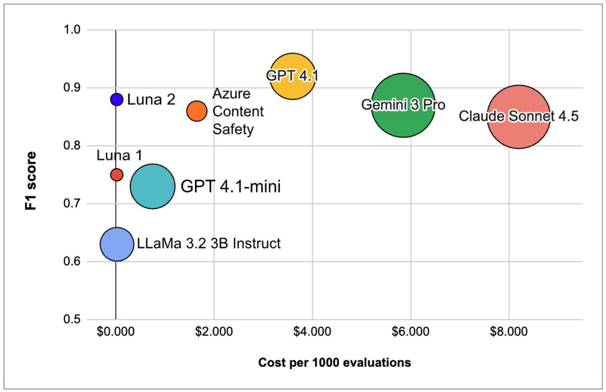

Frontier model Pareto frontiers are pretty cool, but there's a class of models that aims to shoot up vertically on these frontiers for specific tasks, like content moderation or PII detection: models like galileo's luna 2

These models are super cheap to run, have low latency, perform deterministic inference, and are fine-tuned for a specific thing. The idea is you can run them basically continuously on production data streams. 

Charles Frye told us about how there are multiple frontiers, or edges, of AI progress. These small models don't compete at the intelligence or capability “edge” that general-purpose frontier models operate at, but it's still an exciting edge.
 Putting specialized models in all sorts of places is another kind of AI revolution, even if not the ASI-type one.

Their [paper](https://arxiv.org/abs/2602.1858) goes into technical detail on how they achieve this.
